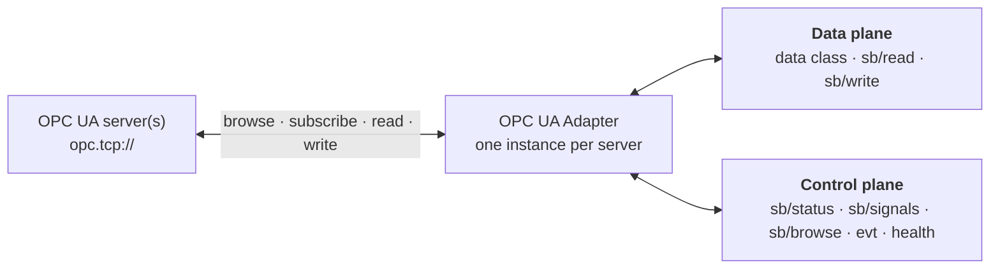
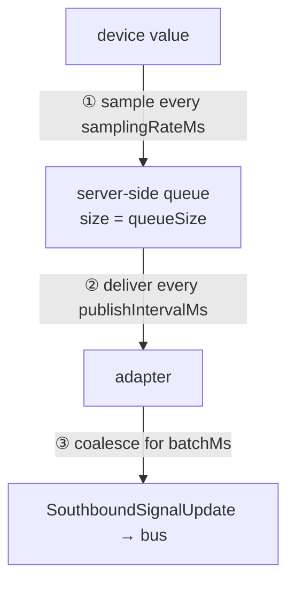

# Explanation — How the Adapter Works and Why

This page explains the ideas behind the adapter so that the configuration options and message
interface make sense as a whole. If you only need a specific value or a step-by-step procedure, the
[reference](reference/) and the [how-to guides](how-to-guides.md) are quicker.

## What the adapter is for

Industrial servers speak OPC UA; the rest of your system speaks messages on a bus. The adapter is the
translator between those two worlds. It connects to one or more OPC UA servers, watches the signals you
care about, and re-publishes their values as structured messages — and in the other direction, it
lets a client read or write signals on demand without knowing anything about OPC UA.

It is deliberately thin. All the cross-cutting concerns an edge component needs — configuration,
messaging transport, metrics, credentials, lifecycle — come from the `edgecommons` library, so the
adapter contains only OPC UA logic. That logic is built on **Eclipse Milo**, the mature OPC UA stack
for the JVM.

## One server, one instance

The organizing principle is that **each OPC UA server is one independent instance**. An instance owns
its connection, its security, its subscriptions, its topics, and its own thread of control. A single
deployment can bridge a dozen servers simply by listing a dozen instances; they share nothing but the
process.

This independence shapes the runtime behavior. Each instance connects on its own thread and retries
on failure, so a server that is slow to boot delays only its own instance, not the component. The
component declares itself *ready* as soon as the first instance is connected and subscribing — a
useful signal for orchestrators that gate traffic on readiness. Liveness is event-driven: a Milo
`SessionActivityListener` (in `OpcUaConnection`) flips the instance's `connected`
state the moment its session drops or recovers, so a server that dies *mid-session* immediately reads
`connected:false` in `state.instances[]` and raises `evt/critical/connection-lost` — with no active
probe.

A boolean alone, though, cannot tell an operator *why* a server is quiet. Each instance therefore also
reports a condition token — `CONNECTING`, `ONLINE`, `BACKOFF`, or `PAUSED` — on the keepalive entry
and in the `sb/status` reply. Both surfaces read the one per-instance state model (`HealthState`), so
a pushed keepalive and a pulled status can never disagree, and an instance a person deliberately
paused is distinguishable from one that silently went stale.

## Inside an instance: a small set of collaborators

The adapter is a set of focused collaborators,
each with one responsibility, assembled by a thin coordinator (`OpcUaDevice`):

| Collaborator | Responsibility |
|---|---|
| `OpcUaConnection` | Create the OPC UA client for the configured security policy and connect with retry. |
| `AddressSpaceBrowser` | Walk the server's address space and collect its variable nodes. |
| `SubscriptionManager` | Match nodes to your signal specs and maintain the OPC UA subscriptions. |
| `SignalUpdatePublisher` | Turn value changes into `SouthboundSignalUpdate` messages, batching per signal. |
| `CommandService` | Serve the command surface: writes (with optional ack), on-demand reads (list and/or regex), and status/subscriptions/nodes queries. |
| `ValueCodec` | Convert between OPC UA values and the JSON contract (types, quality, timestamps). |
| `HealthMetrics` / `OpcUaOperationalMetrics` | Define and emit connection/error plus command, subscription, browse, and connection metrics. |

You do not interact with these classes directly, but knowing the shape helps when reading logs — each
logs under its own name with the instance id as a prefix (`[kep1]`), so a connection problem and a
subscription problem are easy to tell apart.

## Two planes: data and control

The adapter's message interface divides cleanly into two planes, and keeping them straight is the key
to integrating with it.

The **data plane** carries process values. It is the high-volume traffic: a continuous stream of signal
updates flowing out to the bus on the UNS **`data`** class
(`ecv1/{device}/{component}/{instance}/data/{signalPath}`), plus on-demand reads and writes via the
`sb/read` / `sb/write` command verbs. This is the reason the adapter exists.

The **control plane** carries management. It is low-volume and about the *adapter itself* rather than
the process: "are you connected?" (`sb/status`), "what are you subscribed to?" (`sb/signals`),
"what's available on the server?" (`sb/browse`), the operator `evt` alarms, and the
`southbound_health` / OPC UA operational metrics. A monitoring system lives here; a process historian
lives on the data plane.

The split tells an integrator what to build. A consumer of telemetry subscribes one UNS wildcard,
`ecv1/+/+/+/data/#`, and ignores the rest. An operations dashboard issues the `cmd/sb/*` queries,
watches `ecv1/+/+/+/evt/#`, and reads the health/operational metrics. The exact topics and payloads are in the
[messaging reference](reference/messaging-interface.md).

## The timing pipeline (the thing most worth understanding)

A value does not travel from the device to the bus in one step. It passes through three stages, and
each stage has its own timing control. Confusing these three is the single most common source of
"why is my data too fast, too slow, or too laggy" problems.

**Sampling decides resolution.** `samplingRateMs` is how often the server *looks at* the underlying
value. A signal that changes faster than the sampling interval is only observed at sample boundaries.
Sampling at `0` means "as fast as the server allows," which is usually what you want unless you are
deliberately throttling a noisy source.

**Publishing decides latency.** `publishIntervalMs` is how often the server *sends you* what it has
sampled. Between publishes, samples accumulate in a per-signal queue on the server. A shorter publish
interval lowers end-to-end latency; a longer one reduces network chatter and lets the server batch.

**Batching decides message granularity.** `batchMs` is the adapter's own client-side coalescing. With
batching on, the adapter buffers a signal's incoming samples and emits one message per signal per interval,
which may carry several `samples`. With batching off (`0`), each sample becomes its own message the
moment it arrives.

These compound. Sampling at 50 ms, publishing at 1 s, and batching at 1 s yields messages that each
carry roughly twenty samples and arrive about a second after the values were read.

The queue ties them together. It holds the samples taken between two publishes, and when it overflows
the **oldest samples are discarded** (the OPC UA default). To avoid silently losing data, the queue
should be at least `publishIntervalMs / samplingRateMs` deep — sample at 50 ms and publish at 1 s, and
about twenty samples arrive each cycle, so a queue of fifty is comfortable while ten would drop data.

**Deadband** acts before the queue. It tells the *server* to ignore changes smaller than a threshold,
so insignificant jitter never enters the pipeline at all. An absolute deadband suppresses changes
below a fixed amount in engineering units; a percent deadband expresses that threshold as a fraction
of the signal's range and therefore depends on the server advertising that range. A firm deadband on a
fast sampler is often better than a slow sampler, because it preserves genuine fast transients while
discarding noise.

## Addressing signals, and a trap

OPC UA identifies every node by a pair: a **namespace index** and an **identifier** (a string, a
number, a GUID, or opaque bytes). The adapter selects nodes by pinning the namespace and matching the
identifier with a regular expression.

The trap is that **namespace indexes are not stable.** A server publishes a namespace *table* mapping
URIs to indexes, and that mapping can change between servers and even across a restart of the same
server. The **namespace URI is the stable identity**; the index is only a volatile handle into the
server's current table.

So configure signals by **`namespaceUri`** rather than a literal index. At connect time the adapter reads
the server's namespace table and resolves each URI to its current index, re-resolving whenever it
rebuilds subscriptions — so a server that renumbers after a restart is followed automatically. A
literal `namespace` index is still accepted as a fallback for servers you know to be stable. If a
configured URI is not present on the server, that matcher is skipped with a warning, and the
`subscriptions` control query shows exactly what resolved.

There is also an asymmetry worth internalizing: an **include** matcher tests its regex against a
node's identifier, browse name, *and* display name, while an **exclude** matcher tests only the
identifier. The rationale is that you usually select signals by their human-readable names but exclude
specific ones by their stable id. The practical consequence is that an exclude rule written against a
display name does nothing — write exclusions against the identifier.

## The southbound contract

Every signal update the adapter publishes uses one envelope shape, `SouthboundSignalUpdate`, defined by the
cross-language *southbound contract* that all protocol adapters in this ecosystem share. The point of
a shared contract is that a consumer written against it does not care whether the data originated from
OPC UA, Modbus, or anything else — the message looks the same.

Two design choices in that contract are worth calling out. First, **quality is normalized.** OPC UA
has a rich space of status codes; the contract collapses them to `GOOD`, `BAD`, or `UNCERTAIN` so
consumers can make decisions without an OPC UA lookup table, while preserving the native code in
`qualityRaw` for diagnostics. Second, **identity is split** into a canonical, stable `signal.id` that
consumers should key on and a protocol-native `address` (`{ns, namespaceUri, nodeId}`) that
round-trips back to the device for reads and writes. The address reports the namespace **URI**
alongside the index, so the round-trip identity does not depend on a volatile index either.

**Where the enterprise identity lives (UNS).** Separately from that per-signal identity, *every*
message the adapter publishes carries a top-level **`identity`** element — the enterprise hierarchy
(`site/shop/line/device`, from the `hierarchy` + `identity` config), the component, and the instance —
stamped automatically by the library. Routing and partitioning read that element (or the topic's
`device/component/instance` segments); they never parse the body. The site hierarchy is **not** in the
data topic and is **not** in `tags` — it is the `identity` element. The
adapter never hand-mints a `data`/`evt` topic or hand-builds a body: it goes through the library's
`instance.data()`/`instance.events()` publish facades, which mint the topic via the per-instance
`gg.instance(id).uns()` builder (enforcing the UNS grammar and the IoT-Core topic-depth guard at build
time), stamp the envelope identity, and construct + validate the class body (defaulting an omitted
`quality`/`serverTs`/`timestamp`, and — for `evt` — deriving the `{severity}/{type}` channel from the
body so the two can never disagree).

## The security model

A secure OPC UA channel is **mutually authenticated**: the adapter must trust the server's
certificate, and the server must trust the adapter's. Both sides present an *application instance
certificate*, and the channel signs and (optionally) encrypts every message.

The adapter's identity — its certificate and private key — comes from a configurable source: the
encrypted `edgecommons` **credentials vault**, plain **files**, or a **PKCS#11 token** where the private
key never leaves the hardware. The vault is the recommended source because the key is encrypted at
rest and can be delivered through the same secret-management path as the component's other secrets.

Trust of the *server* is explicit. The adapter keeps a PKI directory with `trusted`, `rejected`, and
`issuers` subfolders; a server certificate is accepted only if it (or its issuer) is trusted, and a
rejected certificate is written to `rejected` for an operator to inspect and promote. There is no
"accept anything" mode, by design.

Two requirements trip up almost everyone the first time, because they come from the OPC UA
specification rather than from this adapter, and Milo enforces them strictly:

- An application instance certificate's **key usage** must include `digitalSignature`,
  `nonRepudiation`, `keyEncipherment`, and `dataEncipherment`. A **self-signed** certificate, being
  its own trust anchor, must additionally carry `keyCertSign` and the CA basic constraint.
- The certificate must contain the application's URI in a **SubjectAltName URI**, and the
  `applicationUri` the adapter presents must match it exactly. A mismatch lets the channel open and
  then fails the session — a confusing symptom with a precise cause.

The [how-to guide](how-to-guides.md#connect-to-a-secured-server) shows how to satisfy these in
practice, and `validation/gen_certs.py` generates compliant certificates you can study.
