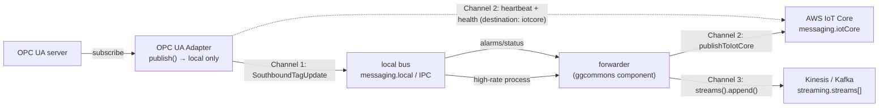

# Sample Configurations

Complete, ready-to-adapt configurations for the OPC UA adapter
(`com.mbreissi.opcua.OpcUaAdapter`), one per realistic deployment scenario. Each sample is a valid
config document; the prose after it explains **what every option does and how it changes runtime
behavior** — data rate, latency, addressing, security, and reconnect/health.

For the exhaustive option list see [reference/configuration.md](reference/configuration.md); for the
topic/message contract see [reference/messaging-interface.md](reference/messaging-interface.md); for
the reasoning behind the timing and security models see [explanation.md](explanation.md); and for
task recipes see [how-to-guides.md](how-to-guides.md).

> **How config reaches the adapter.** The adapter reads one JSON document from the `-c/--config`
> source, which defaults by platform: `HOST` → `FILE`, `GREENGRASS` → `GG_CONFIG` (the deployment),
> `KUBERNETES` → `CONFIGMAP` (a mounted directory, hot-reloaded). Adapter settings live under
> `component`; the sibling sections (`tags`, `messaging`, `logging`, `heartbeat`, `metricEmission`,
> `credentials`, `streaming`) are standard ggcommons sections validated against the canonical
> [config schema](reference/configuration.md).

This page is organized as:

- **[Matching and topic resolution](#matching-and-topic-resolution-read-this-first)** — the two
  mechanisms every example below relies on (which nodes get subscribed, and which topic each tag
  publishes to). Read this first.
- **§1–§3, §6–§7** — one config per platform/security shape (HOST dev, Greengrass IPC, secured
  server, Kubernetes, multiple servers).
- **[§4](#4-real-world-selective-subscription-at-scale)** — a large address space pruned to a precise,
  rate-controlled subset with broad `include` + `exclude`, multiple areas, and grouped timing.
- **[§5](#5-three-channel-telemetry-local-bus--iot-core-control-plane--streaming)** — the
  three-channel telemetry model (local bus, IoT Core control plane, high-throughput streaming).

---

## Matching and topic resolution (read this first)

Two pieces of behavior drive every example: how a subscription **selects** address-space nodes
(`include`/`exclude`), and how a selected tag's value is **addressed** on the bus (the publish
topic). Both are precise and easy to get subtly wrong, so they are spelled out here once.

### Include vs exclude: which nodes get subscribed

At connect time the adapter browses the whole address space (every `Variable` node) and tests each
node against the subscription's matchers. A node is monitored **iff** it matches **at least one
`include`** matcher **and no `exclude`** matcher. There is no ordering between matchers — it is a set
union of `include` minus a set union of `exclude`; the first include that matches supplies the node's
timing/topic.

Each matcher is *namespace + regex*. The two halves are evaluated like this:

| Step | `include` matcher | `exclude` matcher |
|------|-------------------|-------------------|
| 1. Namespace | The matcher's `namespaceUri` is resolved to the server's **current** namespace index (or the literal `namespace` index is used). The node's namespace index must equal it, or the matcher is skipped for that node. An unresolvable `namespaceUri` resolves to index `-1` → the matcher matches nothing (logged as a warning). | same |
| 2. `match` regex | Tested against the node's **identifier, browse name, *and* display name** — a match on **any one** selects the node. | Tested against the **identifier only**. A regex written against a display name does nothing on `exclude`. |

This asymmetry is deliberate: you usually *select* tags by their human-readable names but *exclude*
specific ones by their stable id. See [explanation.md](explanation.md#addressing-tags-and-a-trap).

> **The whole-string-match rule (most common mistake).** `match` is a Java regex evaluated with
> `String.matches()`, which requires the **entire** string to match — it is implicitly anchored at
> both ends. `Sine.*` matches `Sine1` (whole string), but a *substring* pattern like
> `\.Diagnostics\.` matches **nothing**, because no real identifier *equals* `.Diagnostics.`. To match
> "any id containing `.Diagnostics.`", write `.*\.Diagnostics\..*`. Anchors (`^`, `$`) are allowed and
> harmless but redundant. Escape literal dots as `\\.` in JSON.

Three idioms follow from this:

- **Match a whole namespace** (the broadest include) — omit `match` entirely (it defaults to `.*`):
  `{ "namespaceUri": "Kepware Server" }` subscribes to *every* variable node in that namespace.
- **Match a subtree/prefix** — anchor and trail with `.*`: `^Channel1\\.Device1\\..*`.
- **Exclude a subtree anywhere in the id** — surround with `.*`: `.*\\._Statistics\\..*`.

> **Where do `namespaceUri` values come from?** A namespace URI is whatever the server advertises —
> it is server- and configuration-specific. For KEPServerEX it is commonly `Kepware Server` (used in
> these examples and the adapter's `validation/` configs); the OPC UA Foundation base namespace is
> `http://opcfoundation.org/UA/` (index 0). Discover the exact strings your server uses with the
> [`subscriptions` control query](reference/messaging-interface.md#subscriptions-requestreply) — it
> echoes the **resolved** `namespace` index and its `namespaceUri` for every subscribed tag — or by
> reading the server's `NamespaceArray`. Always substitute your server's values.

### Topic resolution: tokens, overrides, and a worked example

Every `SouthboundTagUpdate` is published to a topic built from a template. Resolution happens per tag:
the standard template variables are substituted, then `{tagId}` is replaced with the node's
**identifier** (the bare id, e.g. `Channel1.Device1.Flow` — not the full `ns=2;s=…` form).

| Token | Resolves to | Source |
|-------|-------------|--------|
| `{ThingName}` | the `-t/--thing` value (or the platform identity) | CLI / platform |
| `{ComponentName}` | the component **short** name → `OpcUaAdapter` | binary |
| `{ComponentFullName}` | the fully-qualified name → `com.mbreissi.opcua.OpcUaAdapter` | binary |
| `{InstanceId}` | the instance `id` (e.g. `kep1`) | `instances[].id` |
| `{<key>}` | any key under top-level `tags` (e.g. `{site}`, `{shop}`, `{line}`) | `tags` |
| `{tagId}` | the OPC UA node identifier (publish topics only, substituted per tag) | runtime |

Topic templates resolve in this order of specificity:

```
tag matcher's "topic"  ▸  instance "publish.topic"  ▸  built-in default
                                                       (southbound/{ComponentName}/{InstanceId}/{tagId})
```

A per-matcher `topic` (set on an `include` entry) overrides the instance's `publish.topic` for the
tags that matcher selects — the standard way to route a subset (alarms, events) to its own stream.

**Worked example.** Given `-t edge-gw-01`, `tags.site = "plant1"`, instance `id = "kep1"`, and
`publish.topic = "southbound/{site}/{ComponentName}/{InstanceId}/{tagId}"`:

| Tag (node id) | Matcher that selects it | Resolved publish topic |
|---------------|-------------------------|------------------------|
| `ns=2;s=Channel1.Device1.Flow` | process include (no `topic`) | `southbound/plant1/OpcUaAdapter/kep1/Channel1.Device1.Flow` |
| `ns=2;s=Channel1.Device1.HiHiAlarm` | alarm include with `topic: "alarms/{site}/{InstanceId}/{tagId}"` | `alarms/plant1/kep1/Channel1.Device1.HiHiAlarm` |

> `{tagId}` is the **raw identifier** and is published as a single MQTT topic level even when it
> contains dots (dots are not MQTT separators). Numeric or GUID identifiers appear verbatim
> (`…/kep1/2258`). If your server uses identifiers containing `/`, `+`, or `#`, prefer a per-matcher
> `topic` that does not embed `{tagId}`, or key consumers on `tag.id` in the payload instead.

---

## 1. Minimal local / dev run (HOST + MQTT)

The smallest config that connects to a **plain (unsecured) OPC UA server** and republishes a set of
tags to a local MQTT broker. This is the shape you use against a simulator or a lab KEPServerEX while
developing.

The dual-MQTT transport needs broker details. You can supply them inline under `messaging` (shown
here) or as a separate file passed positionally as `--transport MQTT ./messaging.json`.

```jsonc
// config.json
{
  "tags": { "site": "lab", "shop": "s1", "line": "l1" },

  "messaging": {
    "local": { "type": "mqtt", "host": "localhost", "port": 1883, "clientId": "opcua-adapter" }
  },

  "logging": { "level": "INFO" },

  "metricEmission": {
    "target": "messaging",
    "targetConfig": { "topic": "metrics/{ThingName}/{ComponentName}" }
  },

  "component": {
    "global": {
      "defaults": { "publishIntervalMs": 1000, "samplingRateMs": 500, "queueSize": 100 }
    },
    "instances": [
      {
        "id": "sim1",
        "adapter": "opcua",
        "connection": { "endpoint": "opc.tcp://localhost:4840/", "securityPolicy": "None" },
        "publish": { "topic": "southbound/{site}/{ComponentName}/{InstanceId}/{tagId}", "batchMs": 1000 },
        "write":   { "enabled": false },
        "read":    { "topic": "southbound/{ComponentName}/{InstanceId}/read" },
        "subscriptions": [
          {
            "id": "all",
            "include": [ { "namespaceUri": "urn:ggcommons:sim", "match": "Sine.*" } ]
          }
        ]
      }
    ]
  }
}
```

Run it:

```bash
java -jar target/OpcUaAdapter-1.0.0.jar --platform HOST --transport MQTT \
  -c FILE ./config.json -t my-thing
# (or, with a separate broker file: --transport MQTT ./messaging.json)
```

| Option | Effect on runtime behavior |
|--------|----------------------------|
| `tags` | Site/asset identity. Each key is attached to every published message and is usable as a topic template variable (`{site}` above). Keys must match `^[a-zA-Z0-9_-]+$` and values are strings. Pure metadata — changing it does not affect connectivity, only message tagging and topic resolution. |
| `messaging.local` | The **local** MQTT broker the adapter publishes to and listens on. `host`/`port` point at the broker; `clientId` is the MQTT client identity (keep it unique per process or the broker drops the older session). On HOST this is one half of the dual-MQTT transport; add an `iotCore` block (see §3/§5) to also connect to AWS IoT Core. Without a reachable broker the adapter cannot publish or accept commands. |
| `metricEmission.target` | Where the `southbound_health` metric goes (`log` / `messaging` / `cloudwatch` / `cloudwatchcomponent` / `prometheus`). With `messaging`, health is published to `targetConfig.topic`; with `log` it only appears in logs. Observability only — it does not change OPC UA behavior. |
| `component.global.defaults` | Fallback timing for every instance/tag that does not set its own. `publishIntervalMs` (server→adapter delivery cadence), `samplingRateMs` (how often the server samples the value; `0` = as fast as the server allows), `queueSize` (server-side per-tag buffer). See the precedence table at the end. |
| `instances[].id` | Stable, unique instance id (**required**). Appears as `{InstanceId}` in topics and as `device.instance` in messages. Each instance is one OPC UA server with its own connection thread, so renaming it changes topic routing and message identity. |
| `instances[].adapter` | The southbound **adapter type** that should service this instance. This is a single-protocol binary: it treats *every* listed instance as an OPC UA server (it does **not** filter on this field today), and the published `device.adapter` is always `"opcua"`. Set it to `"opcua"` for clarity and forward-compatibility with the shared southbound convention (where one config can describe instances for several adapter binaries, e.g. an OPC UA and a Modbus adapter). |
| `connection.endpoint` | The OPC UA server URL (`opc.tcp://host:port/`). The adapter connects here on a dedicated thread and **retries on failure**, so a server that is slow to boot delays only this instance, not the component. Empty by default (you must set it). |
| `connection.securityPolicy: "None"` | Unencrypted, **anonymous** channel — no certificates required. Fine for a trusted LAN/dev. For a secured server see §3. |
| `publish.topic` | Topic template for `SouthboundTagUpdate` messages; resolved per the [topic rules](#topic-resolution-tokens-overrides-and-a-worked-example) above. Default (if omitted): `southbound/{ComponentName}/{InstanceId}/{tagId}`. |
| `publish.batchMs` | Client-side coalescing window. `1000` here means the adapter buffers a tag's samples and emits **one message per tag per second** (each may carry several `samples`), reducing message count. Set `0` to emit one message the instant each sample arrives (lowest latency, most messages). Defaults to the resolved instance `publishIntervalMs` when omitted. |
| `write.enabled: false` | The adapter does **not** subscribe to the write topic, so writes are rejected. Set `true` (see §3/§4) to accept writes. Default `false`. |
| `read.topic` | Request/reply topic for on-demand reads. Always available regardless of `write.enabled`. Default `southbound/{ComponentName}/{InstanceId}/read`. |
| `subscriptions[].include` | The tag matchers to subscribe to. With only `{ "match": "Sine.*" }` and no timing overrides, these tags inherit `global.defaults`. (`Sine.*` whole-string-matches identifiers/names like `Sine1`, `Sine2`.) |

---

## 2. Greengrass v2 deployment (IPC) — on-device shape

On `--platform GREENGRASS` there is **no messaging broker block and no config file**: messaging uses
Greengrass IPC (`--transport IPC`, the default for this platform) and the config arrives from the
deployment's `ComponentConfiguration`. The sample below is the `ComponentConfig` block exactly as it
sits in `recipe.yaml` (YAML, because the recipe is YAML); a cloud deployment overrides the same keys
via `aws greengrassv2`.

```yaml
# recipe.yaml — ComponentConfiguration.DefaultConfiguration.ComponentConfig
ComponentConfig:
  logging:
    level: "INFO"
  heartbeat:
    intervalSecs: 5
    targets:
      - type: "messaging"
        config:
          destination: "ipc"                       # heartbeats go out over IPC, not a TCP broker
          topic: "heartbeat/{ThingName}/{ComponentName}"
    measures: { cpu: true, memory: true, disk: false, fds: true, files: true }
  tags: { site: "plant1", shop: "assembly", line: "5" }
  metricEmission:
    target: "log"
    targetConfig:
      logFileName: "/greengrass/v2/logs/{ComponentFullName}.metric.log"
  component:
    global:
      defaults: { publishIntervalMs: 1000, samplingRateMs: 500, queueSize: 100 }
    instances:
      - id: "kep1"
        adapter: "opcua"
        connection: { endpoint: "opc.tcp://192.168.1.50:49320/", securityPolicy: "None" }
        publish: { topic: "southbound/{site}/{ComponentName}/{InstanceId}/{tagId}", batchMs: 1000 }
        write:   { enabled: true }
        read:    { topic: "southbound/{ComponentName}/{InstanceId}/read" }
        subscriptions:
          - id: "process"
            include:
              - { namespaceUri: "Kepware Server", match: "^Channel1\\.Device1\\..*" }
```

Run on-device (config comes from the deployment, so no `-c`):

```bash
java -jar OpcUaAdapter-1.0.0.jar --platform GREENGRASS -t my-thing
# package/publish: gdk component build && gdk component publish
```

| Difference from HOST | Effect on runtime behavior |
|----------------------|----------------------------|
| No `messaging` section; transport is IPC | The adapter publishes/subscribes through the Nucleus's local IPC pub/sub (and the IoT Core mqttproxy) instead of a TCP MQTT broker. The recipe's `accessControl` grants the IPC and `mqttproxy` topics; the message envelope on the wire is identical to HOST. |
| `heartbeat.targets[].config.destination: "ipc"` | Routes the periodic system heartbeat over the local IPC transport. On HOST you would omit this (it goes to the local MQTT broker). Use `"iotcore"` to push it to AWS IoT Core instead (see §5). |
| `metricEmission.target: "log"` with a `/greengrass/v2/logs/...` path | Health metrics are written to the Nucleus-managed component log directory rather than published — convenient because Greengrass already rotates and ships those logs. |
| `connection` / `publish` / `subscriptions` | **Identical semantics to HOST.** The OPC UA side does not know or care about the platform; only the transport and config source change. You can lift an instance verbatim between HOST and GREENGRASS. |
| Cloud override | A `aws greengrassv2 create-deployment` merge config patches these same keys per device/group, so per-site `endpoint`/`tags`/`subscriptions` differences are deployment data, not code. |

> The component reports **ready** as soon as its first instance is connected and subscribing — a
> signal orchestrators can gate on. Each instance reconnects independently with retry, so one
> unreachable server never blocks the others.

---

## 3. Secured OPC UA server (policy + certificates + user)

A mutually-authenticated, encrypted channel using `Basic256Sha256` / `SignAndEncrypt`, plus a
UserName identity token. This is the production shape against a hardened KEPServerEX. It also shows
the **dual-MQTT** messaging block (local broker **and** AWS IoT Core) you would use on a HOST gateway.

```jsonc
// config.json
{
  "tags": { "site": "plant1", "shop": "assembly", "line": "5" },

  "messaging": {
    "local":   { "type": "mqtt", "host": "localhost", "port": 1883, "clientId": "opcua-adapter" },
    "iotCore": {
      "endpoint": "xxxx-ats.iot.us-east-1.amazonaws.com",
      "port": 8883,
      "clientId": "opcua-adapter",
      "credentials": { "certPath": "creds/device.cert.pem", "keyPath": "creds/device.key", "caPath": "creds/root-CA.crt" }
    }
  },

  "credentials": { "vault": { "path": "/var/lib/opcua/{InstanceId}/vault" } },

  "component": {
    "global": { "defaults": { "publishIntervalMs": 1000, "samplingRateMs": 500, "queueSize": 50 } },
    "instances": [
      {
        "id": "kep1",
        "adapter": "opcua",
        "connection": {
          "endpoint": "opc.tcp://192.168.1.50:49320",
          "securityPolicy": "Basic256Sha256",
          "messageMode": "SignAndEncrypt",
          "clientCertificate": { "source": "vault", "secret": "opcua/kep1/appcert" },
          "trust": {
            "pkiDir": "/var/lib/opcua/{InstanceId}/pki",
            "serverCertificate": { "source": "file", "path": "/etc/opcua/kep1-server.pem" }
          },
          "user": { "source": "vault", "secret": "opcua/kep1/login" }
        },
        "publish": { "topic": "southbound/{site}/{ComponentName}/{InstanceId}/{tagId}", "batchMs": 1000 },
        "write":   { "enabled": true },
        "read":    { "topic": "southbound/{ComponentName}/{InstanceId}/read" },
        "subscriptions": [
          { "id": "process",
            "include": [ { "namespaceUri": "Kepware Server", "match": "^Channel1\\.Device1\\..*" } ] }
        ]
      }
    ]
  }
}
```

### Messaging & credentials options

| Option | Effect on runtime behavior |
|--------|----------------------------|
| `messaging.iotCore` | Adds the **cloud** half of the dual-MQTT transport. The adapter connects to the local broker **and** to AWS IoT Core over mutual TLS on `8883`. `credentials.certPath`/`keyPath`/`caPath` are the device's X.509 identity for IoT Core; a missing/expired cert means the cloud leg fails to connect (the local leg is unaffected). **Note:** connecting both legs does not by itself send tag updates to the cloud — the adapter's tag-update `publish` goes to the **local** bus only; see [§5](#5-three-channel-telemetry-local-bus--iot-core-control-plane--streaming) for what actually traverses the IoT Core leg and how. |
| `credentials` | Enables the encrypted local vault. **Required** whenever any `source: "vault"` reference is used (here for the client cert and the OPC UA user). Without it, those references cannot resolve and the secure connection fails to start. `vault.path` supports template variables. |

### Connection & security options

| Option | Effect on runtime behavior |
|--------|----------------------------|
| `connection.securityPolicy` | Milo `SecurityPolicy` name: `None`, `Basic256Sha256`, `Aes128_Sha256_RsaOaep`, `Aes256_Sha256_RsaPss`, etc. Anything other than `None` requests an **encrypted, signed** channel: the adapter must present an application instance certificate the server trusts, and must trust the server's. An unrecognized value falls back to `None` with a warning. |
| `connection.messageMode` | `MessageSecurityMode`: `None`, `Sign` (integrity only), or `SignAndEncrypt` (integrity + confidentiality). Under any non-`None` policy a `messageMode` of `None` is **auto-upgraded to `SignAndEncrypt`** (with a warning). |
| `connection.clientCertificate` | The adapter's identity (cert + private key), selected by `source` — see the next table. Secure connections only. Default `source` is `vault`. |
| `connection.trust.pkiDir` | Directory holding the trust store; the adapter creates `trusted/`, `rejected/`, `issuers/` under it (template path; default `pki/{InstanceId}`). A server cert is accepted only if it (or its issuer) is in `trusted/`; an untrusted cert is written to `rejected/` for an operator to inspect and promote. **There is no auto-trust mode.** |
| `connection.trust.serverCertificate` | Optionally **pins** the expected server certificate up front so the first connection succeeds without a manual promote step: `{ "source": "file", "path": … }` or `{ "source": "vault", "secret": …, "field": "caPem" }`. |
| `connection.user` | A **UserName identity token**, independent of channel security (KEPServerEX rejects anonymous logins even on its `None` endpoint). `source: "vault"` reads a `BasicAuth` (`{username, password}`) secret; the inline form `{ "username": …, "password": … }` is for dev only — **keep configs with inline passwords out of version control.** The server applies that user's authorization, so an under-privileged account can yield empty subscriptions even when the connection succeeds. Omit for anonymous. |
| `connection.applicationUri` (not shown) | Leave unset; the adapter derives it from the client certificate's SubjectAltName URI, which the server requires to match. Setting it wrong lets the channel open and then fails the session. |

### `clientCertificate.source` — the three identity sources

| `source` | Keys | What it does |
|----------|------|--------------|
| `vault` *(default)* | `secret` | Reads a `TlsBundle` (`{certPem, keyPem, caPem}`) from the credentials vault. Recommended — the private key is encrypted at rest. Requires a `credentials` section. |
| `file` | `certPath`, `keyPath` | Reads PEM certificate and private-key files (paths support template variables). The key sits on disk in clear. |
| `pkcs11` | `modulePath`, `slotIndex` *(default 0)*, `pin` **or** `pinEnv`, `keyLabel`, `certLabel` | Key + certificate live on a PKCS#11 token (HSM/TPM); the private key never leaves the hardware. Prefer `pinEnv` (env var name) over an inline `pin`. |

> **Two spec requirements that trip everyone up:** the client certificate's **key usage** must
> include `digitalSignature`, `nonRepudiation`, `keyEncipherment`, `dataEncipherment` (a self-signed
> cert also needs `keyCertSign` + the CA constraint), and its **SAN URI must equal** the
> `applicationUri` the adapter presents. See [the security how-to](how-to-guides.md#connect-to-a-secured-server)
> and `validation/gen_certs.py` for a compliant cert generator.

---

## 4. Real-world selective subscription at scale

A production OPC UA server is not a handful of sine waves — a single KEPServerEX can expose thousands
of tags across multiple channels and devices, plus alarm folders and a noisy `_System`/`_Statistics`
diagnostics tree. The realistic pattern is therefore: **subscribe broadly, then prune**, and split
the result into groups that each get the cadence, queue depth, deadband, and topic they deserve.

This config bridges a packaging line on a KEPServerEX with two channels (`Channel1` = line PLCs,
`Channel2` = the energy/utilities meters) into three subscription groups:

- **`process`** — the fast process variables. A *broad* include of both channels, with `exclude`
  matchers that strip the per-device diagnostics, statistics, and `_System` housekeeping so they do
  not flood the data plane. Low latency, with a small absolute deadband to kill sensor jitter.
- **`alarms`** — every alarm tag across all channels, captured at the server's fastest sampling so no
  transition is missed, with a **per-tag topic override** routing them to a dedicated `alarms/…`
  topic. No deadband (you never want to deadband a discrete alarm).
- **`diagnostics`** — the slow housekeeping you *do* want (server clock, comms counters) at a 10 s
  cadence so it costs almost nothing.

```jsonc
// component section only — drop into any of the platform shapes above
"component": {
  "global": {
    "defaults": { "publishIntervalMs": 1000, "samplingRateMs": 500, "queueSize": 100 }
  },
  "instances": [
    {
      "id": "kep1",
      "adapter": "opcua",
      "connection": {
        "endpoint": "opc.tcp://192.168.1.50:49320",
        "securityPolicy": "None",
        "user": { "source": "vault", "secret": "opcua/kep1/login" }
      },
      "defaults": { "publishIntervalMs": 1000, "samplingRateMs": 500, "queueSize": 100 },
      "publish": { "topic": "southbound/{site}/{ComponentName}/{InstanceId}/{tagId}", "batchMs": 1000 },
      "write":   { "enabled": true },
      "read":    { "topic": "southbound/{ComponentName}/{InstanceId}/read" },
      "subscriptions": [
        {
          "id": "process",
          "publishIntervalMs": 200,
          "include": [
            { "namespaceUri": "Kepware Server", "match": "^Channel1\\..*",
              "samplingRateMs": 100, "queueSize": 50,
              "deadband": { "type": "Absolute", "value": 0.5 } },
            { "namespaceUri": "Kepware Server", "match": "^Channel2\\..*",
              "samplingRateMs": 1000, "queueSize": 10,
              "deadband": { "type": "Percent", "value": 1.0 } }
          ],
          "exclude": [
            { "namespaceUri": "Kepware Server", "match": ".*\\._System\\..*" },
            { "namespaceUri": "Kepware Server", "match": ".*\\._Statistics\\..*" },
            { "namespaceUri": "Kepware Server", "match": ".*\\.Diagnostics\\..*" },
            { "namespaceUri": "Kepware Server", "match": ".*\\.Alarms\\..*" }
          ]
        },
        {
          "id": "alarms",
          "publishIntervalMs": 250,
          "include": [
            { "namespaceUri": "Kepware Server", "match": ".*\\.Alarms\\..*",
              "samplingRateMs": 0, "queueSize": 100,
              "topic": "alarms/{site}/{InstanceId}/{tagId}" }
          ]
        },
        {
          "id": "diagnostics",
          "publishIntervalMs": 10000,
          "include": [
            { "namespaceUri": "Kepware Server", "match": "^_System\\..*",
              "samplingRateMs": 5000, "queueSize": 2 },
            { "namespaceUri": "Kepware Server", "match": ".*\\._Statistics\\..*",
              "samplingRateMs": 5000, "queueSize": 2 }
          ]
        }
      ]
    }
  ]
}
```

What this achieves, tag by tag:

| Tag | Group / matcher | Outcome |
|-----|-----------------|---------|
| `Channel1.Device1.Flow` | `process` ▸ `^Channel1\..*` | sampled every 100 ms, ±0.5-unit deadband, delivered every 200 ms, batched to `southbound/{site}/…/kep1/Channel1.Device1.Flow` |
| `Channel2.Meter1.kWh` | `process` ▸ `^Channel2\..*` | sampled every 1 s, 1 %-of-range deadband (slow meter), delivered every 200 ms |
| `Channel1.Device1.Diagnostics.Successful Reads` | `exclude` ▸ `.*\.Diagnostics\..*` | **dropped** — matched by `process` include but pruned by exclude |
| `Channel1.Device1.Alarms.HiHi` | `alarms` ▸ `.*\.Alarms\..*` | captured at server-fastest sampling, routed to `alarms/{site}/kep1/Channel1.Device1.Alarms.HiHi` |
| `_System._Time_Second` | `diagnostics` ▸ `^_System\..*` | delivered every 10 s, tiny queue — near-zero cost |

> **Why the `process` group also excludes `.*\.Alarms\..*`:** a node can match more than one
> subscription. Excluding the alarm subtree from `process` keeps each alarm tag in exactly one group
> (`alarms`), so it is monitored once, with the alarm group's timing and topic — not twice.

### Subscription & tag-matcher options (complete)

| Option | Scope | Effect on runtime behavior |
|--------|-------|----------------------------|
| `subscriptions[]` | per group | Each entry is an independent OPC UA subscription with its **own `publishIntervalMs`**. Split tags by how fresh they must be so each group gets the cadence it needs without over-publishing the rest. |
| `subscriptions[].id` | per group | Identifier used in logs and the `subscriptions` control query. Defaults to a random UUID — set it so logs are readable. |
| `subscriptions[].publishIntervalMs` | per group | How often the **server delivers** that subscription's accumulated samples to the adapter. `200` ms → low latency; `10000` ms → cheap housekeeping. Overrides the instance/global default for this subscription only. |
| `include[]` / `exclude[]` | per group | The matcher lists. A node is monitored iff it matches **some `include`** and **no `exclude`** — see [matching semantics](#include-vs-exclude-which-nodes-get-subscribed). `exclude` is optional. |
| `namespaceUri` | per matcher | Pins the OPC UA namespace by its **URI** (preferred). Resolved to the server's current index at connect time and re-resolved on rebuild, so a server that renumbers after a restart is followed automatically. An unresolved URI skips the matcher (with a warning). |
| `namespace` | per matcher | Literal namespace **index**, used only when `namespaceUri` is absent (default `0`). Indexes are volatile across servers/restarts — use only for servers you know to be stable. |
| `match` | per matcher | Java regex, **whole-string** match (see the [match rule](#include-vs-exclude-which-nodes-get-subscribed)). On `include` it tests identifier/browse name/display name; on `exclude` the identifier only. Defaults to `.*` (whole namespace) when omitted. |
| `topic` | per `include` matcher | Per-tag publish-topic **override** (e.g. routing alarms to `alarms/…`). Falls back to the instance `publish.topic`. Has no effect on `exclude`. |
| `samplingRateMs` | per matcher | How often the **server samples** the underlying value. `0` = as fast as the server allows; a larger value throttles a noisy source. A signal changing faster than this is only observed at sample boundaries — sampling sets the **resolution**. Inherits the instance/global default when omitted. |
| `queueSize` | per matcher | Server-side buffer holding samples taken between two publishes. On overflow the **oldest samples are discarded**. Keep `queueSize ≥ ceil(publishIntervalMs / samplingRateMs)` or you silently drop data — here the `process` group is `200/100 = 2`, so `50` is generous. Inherits the instance/global default when omitted. |
| `deadband` | per matcher | A **server-side** filter applied *before* the queue: the server ignores changes smaller than the threshold, so jitter never enters the pipeline. `type: "Absolute"` suppresses changes below `value` engineering units; `type: "Percent"` expresses `value` as a fraction of the tag's range (requires the server to advertise that range); `type: "None"` (default) disables it. Types are case-sensitive. Never deadband discrete/alarm tags. |

### Multiple namespaces

The example above uses multiple **areas** (channels) within one namespace URI. Servers that expose
genuinely separate namespaces — an aggregating gateway, or a vendor server that namespaces by
area/protocol — are handled the same way: give each matcher its own `namespaceUri`.

```jsonc
"include": [
  { "namespaceUri": "urn:acme:packaging:line5",  "match": "^Filler\\..*" },
  { "namespaceUri": "urn:acme:utilities:meters",  "match": "^Meter\\..*", "samplingRateMs": 2000 },
  { "namespaceUri": "http://opcfoundation.org/UA/", "match": "CurrentTime" }
]
```

Each `namespaceUri` is resolved independently against the server's namespace table; the regex still
matches whole-string against id/browse/display name within that namespace.

### The timing pipeline at a glance

A value passes through three stages, each with its own control (full discussion in
[explanation.md](explanation.md#the-timing-pipeline-the-thing-most-worth-understanding)):

| You want… | Set |
|-----------|-----|
| One current value per tag per second | `samplingRateMs` and `publishIntervalMs` both ≈ `1000`, small `queueSize`. |
| Every change, low latency | small `samplingRateMs` (e.g. `100`), small `publishIntervalMs` (e.g. `200`), `queueSize ≥ publish/sample`. |
| Fewer, larger messages | raise `batchMs` (the adapter coalesces a tag's samples into one message). |
| One message per change | `batchMs: 0`. |
| Drop sensor noise at the source | add a `deadband`. |

`samplingRateMs` sets **resolution**, `publishIntervalMs` sets **latency**, `batchMs` sets **message
granularity** — and they compound: sampling at 100 ms, publishing at 200 ms, batching at 1 s yields
messages each carrying ~10 samples arriving ~1 s after the values were read.

---

## 5. Three-channel telemetry: local bus + IoT Core control plane + streaming

A high-throughput OPC UA gateway typically routes telemetry over **three** channels, each tuned for a
different volume/latency/cost profile. The ggcommons subsystems for all three coexist in one config
document and one process:

| Channel | Carries | Backed by | Volume / cost profile |
|---------|---------|-----------|-----------------------|
| **1 — local data bus** | every `SouthboundTagUpdate` | `messaging.local` (MQTT) on HOST/k8s, or IPC on Greengrass | high volume, in-site, free |
| **2 — northbound control plane** | low-rate status: heartbeat, `southbound_health`, alarms, commands/acks | `messaging.iotCore` (AWS IoT Core, MQTT) | low rate, per-message addressable, QoS, billed per message |
| **3 — high-throughput streaming** | the bulk high-rate process history | `streaming.streams[]` → Kinesis/Kafka via the embedded `ggstreamlog` durable buffer | very high volume, batched/compressed, billed per shard/throughput |

> **How telemetry actually flows (important).** The adapter's data-plane `publish()` writes to the
> **local bus only** — by design, the edge gateway decides what leaves the site. The adapter itself
> reaches the cloud only for its **own control plane** (it can route heartbeat and the
> `southbound_health` metric to IoT Core via `destination: "iotcore"`). Discrete cloud alarms and
> bulk streaming are done by a **co-located forwarder component** (any ggcommons component) that
> subscribes to the adapter's local topics and re-emits them: low-rate items via
> `messaging.publishToIotCore(...)` (Channel 2), high-rate process tags via
> `gg.getStreams().stream(name).append(...)` (Channel 3). This split is why the per-subscription
> topic structure from §4 matters — it is what makes each class of telemetry separately addressable
> downstream.



### (a) Adapter config — Channel 1, with its control plane on Channel 2

The adapter publishes all tag updates to the local bus, structured so process and alarm tags land on
distinct topics (the forwarder keys off these). Its heartbeat and health metric are routed to IoT
Core directly.

```jsonc
// adapter-config.json  (--platform HOST --transport MQTT)
{
  "tags": { "site": "plant1", "shop": "assembly", "line": "5" },

  "messaging": {
    "local":   { "type": "mqtt", "host": "localhost", "port": 1883, "clientId": "opcua-adapter" },
    "iotCore": {
      "endpoint": "xxxx-ats.iot.us-east-1.amazonaws.com", "port": 8883, "clientId": "opcua-adapter",
      "credentials": { "certPath": "creds/device.cert.pem", "keyPath": "creds/device.key", "caPath": "creds/root-CA.crt" }
    }
  },

  "heartbeat": {
    "intervalSecs": 30,
    "targets": [ { "type": "messaging", "config": { "destination": "iotcore", "topic": "heartbeat/{ThingName}/{ComponentName}" } } ]
  },
  "metricEmission": {
    "target": "messaging",
    "targetConfig": { "destination": "iotcore", "topic": "status/{ThingName}/{ComponentName}/health" }
  },

  "component": {
    "global": { "defaults": { "publishIntervalMs": 200, "samplingRateMs": 100, "queueSize": 50 } },
    "instances": [
      {
        "id": "kep1",
        "adapter": "opcua",
        "connection": { "endpoint": "opc.tcp://192.168.1.50:49320", "securityPolicy": "None",
                        "user": { "source": "vault", "secret": "opcua/kep1/login" } },
        "publish": { "topic": "southbound/{site}/{InstanceId}/process/{tagId}", "batchMs": 1000 },
        "subscriptions": [
          { "id": "process", "publishIntervalMs": 200,
            "include": [ { "namespaceUri": "Kepware Server", "match": "^Channel1\\..*",
                           "deadband": { "type": "Absolute", "value": 0.5 } } ],
            "exclude": [ { "namespaceUri": "Kepware Server", "match": ".*\\.Alarms\\..*" } ] },
          { "id": "alarms", "publishIntervalMs": 250,
            "include": [ { "namespaceUri": "Kepware Server", "match": ".*\\.Alarms\\..*",
                           "samplingRateMs": 0, "topic": "southbound/{site}/{InstanceId}/alarms/{tagId}" } ] }
        ]
      }
    ]
  },
  "credentials": { "vault": { "path": "/var/lib/opcua/{InstanceId}/vault" } }
}
```

This adapter publishes:
- process tags → local `southbound/plant1/kep1/process/<tagId>`
- alarm tags → local `southbound/plant1/kep1/alarms/<tagId>`
- heartbeat + health → **IoT Core** (Channel 2) directly, via `destination: "iotcore"`.

### (b) Forwarder config — Channel 2 (alarms) + Channel 3 (process streaming)

A second, co-located ggcommons component subscribes to the adapter's local topics and fans out. Its
config carries the dual-MQTT block **and** a `streaming` section; its (application) logic appends each
high-rate process message to the durable stream and republishes each alarm to IoT Core.

```jsonc
// forwarder-config.json  (--platform HOST --transport MQTT)
{
  "tags": { "site": "plant1" },

  "messaging": {
    "local":   { "type": "mqtt", "host": "localhost", "port": 1883, "clientId": "opcua-forwarder" },
    "iotCore": {
      "endpoint": "xxxx-ats.iot.us-east-1.amazonaws.com", "port": 8883, "clientId": "opcua-forwarder",
      "credentials": { "certPath": "creds/device.cert.pem", "keyPath": "creds/device.key", "caPath": "creds/root-CA.crt" }
    }
  },

  "streaming": {
    "streams": [
      {
        "name": "process-telemetry",
        "sink": { "type": "kinesis", "streamName": "{site}-process-telemetry", "region": "us-east-1" },
        "buffer": {
          "type": "disk",
          "path": "/var/lib/ggstreamlog/{ComponentName}/process",
          "maxDiskBytes": 2147483648,
          "onFull": "dropOldest",
          "fsync": "perBatch"
        },
        "batch": { "maxRecords": 500, "maxBytes": 4194304, "maxLatencyMs": 1000, "compression": "zstd" },
        "delivery": { "maxRetries": -1, "backoffBaseMs": 50, "backoffMaxMs": 30000, "pollIntervalMs": 100 }
      }
    ]
  },

  "component": {}
}
```

The forwarder's business logic (application code, not config) ties the two together:

```text
on local "southbound/plant1/kep1/process/#"  →  gg.getStreams().stream("process-telemetry")
                                                   .append(tagId, sampleTsMs, messageBytes)   // Channel 3
on local "southbound/plant1/kep1/alarms/#"    →  messaging.publishToIotCore(
                                                   "alarms/plant1/kep1/"+tagId, msg, QOS.AT_LEAST_ONCE) // Channel 2
```

So a concrete process tag `Channel1.Device1.Flow`:

```
OPC UA  →  adapter publishes local  southbound/plant1/kep1/process/Channel1.Device1.Flow
        →  forwarder appends to stream "process-telemetry"
        →  ggstreamlog disk buffer  →  Kinesis stream  plant1-process-telemetry
```

and an alarm `Channel1.Device1.Alarms.HiHi`:

```
OPC UA  →  adapter publishes local  southbound/plant1/kep1/alarms/Channel1.Device1.Alarms.HiHi
        →  forwarder republishes    →  AWS IoT Core  alarms/plant1/kep1/Channel1.Device1.Alarms.HiHi
```

### Streaming options

> The `streaming` block conforms to the canonical schema: each `streams[]` entry **requires** `name`
> and `sink`; `buffer`, `batch`, and `delivery` are optional and the embedded `ggstreamlog` core
> supplies defaults for any you omit. Always set `buffer` (and prefer `type: "disk"`) on an edge
> gateway so telemetry survives a cloud disconnect.

**Sink** (`sink`, a tagged union on `type`):

| Sink | Keys | Notes |
|------|------|-------|
| `kinesis` | `streamName` *(required, supports template vars)*, `region`, `endpointUrl` | `endpointUrl` overrides the AWS endpoint — set it for LocalStack/floci/VPC; omit (or `null`) for real Kinesis. |
| `kafka` | `bootstrapServers` *(required)*, `topic` *(required)*, `properties` | `properties` is an open map of extra librdkafka producer settings. |

**Buffer** (`buffer`) — the embedded store-and-forward layer:

| Key | Default | Effect |
|-----|---------|--------|
| `type` | `disk` | `disk` = durable, file-backed (survives restarts/disconnects; needs `path`); `memory` = non-durable RAM ring. |
| `path` | — | Buffer directory (disk only; supports template variables). |
| `segmentBytes` | `67108864` | On-disk segment file size. |
| `maxDiskBytes` | `1073741824` | Backlog byte budget. |
| `maxAgeSecs` | — | Optional max record age before drop. |
| `onFull` | `dropOldest` | At the budget: `dropOldest` (favor fresh data), `block` (apply backpressure), or `rejectNew`. |
| `fsync` | `perBatch` | Durability flush policy: `always` / `perBatch` / `interval` (with `fsyncIntervalMs`). |
| `maxBufferedRecords` | `10000` | In-flight record cap. |

**Batch** (`batch`) — export coalescing: `maxRecords` (500), `maxBytes` (4 MiB), `maxLatencyMs`
(1000), `compression` (`none`/`zstd`). **Delivery** (`delivery`) — retry/poll: `maxRetries`
(`-1` = forever), `backoffBaseMs` (50), `backoffMaxMs` (30000), `pollIntervalMs` (100).

### When to route a tag to streaming vs the IoT Core control plane

| Use **Channel 2 — IoT Core (MQTT)** when… | Use **Channel 3 — streaming (Kinesis/Kafka)** when… |
|--------------------------------------------|------------------------------------------------------|
| The message is **low-rate** (alarms, state changes, status, heartbeat, command acks). | The data is **high-rate** continuous process history (many tags × many samples/s). |
| Each message must be **individually addressable/subscribable** (topic-based fan-out, IoT rules). | You want **batched, compressed, ordered** records, not per-message pub/sub. |
| You need **QoS** and round-trip request/reply (commands → acks). | You need a **durable on-disk buffer** that absorbs hours of cloud disconnect with flat memory. |
| Per-message cloud cost is acceptable because volume is small. | Per-message MQTT cost would be prohibitive; per-shard/throughput billing is far cheaper at volume. |

Rule of thumb: **control-plane and exceptions → IoT Core; bulk process telemetry → streaming.** The
local bus (Channel 1) always carries everything in-site; the two northbound channels carry only the
subset each is suited to.

---

## 6. Kubernetes (ConfigMap)

On `--platform KUBERNETES` the config source defaults to `CONFIGMAP`: the whole ConfigMap is mounted
as a **directory** (typically `/etc/ggcommons`) so the adapter watches the kubelet `..data` swap and
**hot-reloads in place** on `kubectl apply` — no restart. The broker config lives in the same
ConfigMap (in-cluster broker via Service DNS); identity comes from the Downward API, so usually **no
CLI args** are needed.

```yaml
# k8s/configmap.yaml
apiVersion: v1
kind: ConfigMap
metadata:
  name: OpcUaAdapter-config
  labels: { app.kubernetes.io/name: OpcUaAdapter }
data:
  config.json: |-
    {
      "messaging": {
        "local": { "type": "mqtt", "host": "emqx.default.svc.cluster.local", "port": 1883, "clientId": "OpcUaAdapter" }
      },
      "logging": { "level": "INFO" },
      "metricEmission": { "target": "prometheus" },
      "tags": { "site": "plant1" },
      "component": {
        "global": { "defaults": { "publishIntervalMs": 1000, "samplingRateMs": 500, "queueSize": 100 } },
        "instances": [
          {
            "id": "kep1",
            "adapter": "opcua",
            "connection": { "endpoint": "opc.tcp://opcua.default.svc.cluster.local:4840/", "securityPolicy": "None" },
            "publish": { "topic": "southbound/{site}/{ComponentName}/{InstanceId}/{tagId}", "batchMs": 1000 },
            "write":   { "enabled": true },
            "subscriptions": [
              { "id": "process",
                "include": [ { "namespaceUri": "Kepware Server", "match": "^Channel1\\.Device1\\..*" } ] }
            ]
          }
        ]
      }
    }
```

| Option | Effect on runtime behavior |
|--------|----------------------------|
| Mounted as a **whole-volume** ConfigMap (never `subPath`) | Preserves the `..data` symlink swap so the `CONFIGMAP` source detects changes and **hot-reloads** subscriptions/timing without a pod restart. Mounting a single key via `subPath` breaks hot reload. |
| `component` section identical to other platforms | The component **name** (`{ComponentName}`) is fixed by the adapter binary, so it does **not** appear in the config — only the `component` *object* (global/instances) does. The same `component`/`connection`/`subscriptions` shape works verbatim on HOST, GREENGRASS, and KUBERNETES. |
| `messaging.local.host` = a Service DNS name | The in-cluster MQTT broker reached via Kubernetes Service DNS (`emqx.default.svc.cluster.local`). Point it at your broker Service. |
| `metricEmission.target: "prometheus"` | Exposes `southbound_health` on the pod's metrics port (default `:9090`) for Prometheus scraping instead of publishing it — the idiomatic k8s path. |
| No `-t/--thing` arg | Identity resolves from the Downward API (`GGCOMMONS_THING_NAME` ▸ `POD_NAME`). The Deployment also gates traffic on the HTTP health probes (`/startupz`, `/livez`, `/readyz`) the library serves on `:8081`. |
| `connection` / `subscriptions` | Same OPC UA semantics as every other platform — only the config **source** (ConfigMap) and the metrics/identity wiring differ. Editing the ConfigMap and re-applying changes the live subscription set on the fly. |

> Deploy with `kubectl apply -f k8s/`; the companion `deployment.yaml` mounts this ConfigMap at
> `/etc/ggcommons` (read-only, whole volume), sets `workingDir: /tmp` (the Java MQTT client needs a
> writable cwd), and wires the health (`8081`) and metrics (`9090`) ports.

---

## 7. One adapter, multiple servers

Because each instance is independent, a single deployment can bridge several OPC UA servers by
listing several `instances` — they share only the process. Mix security and timing per server freely.

```jsonc
"component": {
  "global": { "defaults": { "publishIntervalMs": 500, "samplingRateMs": 200, "queueSize": 20 } },
  "instances": [
    {
      "id": "sim1",
      "adapter": "opcua",
      "connection": { "endpoint": "opc.tcp://10.0.0.11:4840/", "securityPolicy": "None" },
      "publish": { "topic": "southbound/{site}/{ComponentName}/{InstanceId}/{tagId}", "batchMs": 0 },
      "subscriptions": [
        { "id": "sines",
          "include": [ { "namespaceUri": "urn:ggcommons:sim", "match": "Sine.*" } ] }
      ]
    },
    {
      "id": "kep1",
      "adapter": "opcua",
      "connection": {
        "endpoint": "opc.tcp://10.0.0.50:49320",
        "securityPolicy": "Basic256Sha256", "messageMode": "SignAndEncrypt",
        "clientCertificate": { "source": "vault", "secret": "opcua/kep1/appcert" },
        "user": { "source": "vault", "secret": "opcua/kep1/login" }
      },
      "publish": { "topic": "southbound/{site}/{ComponentName}/{InstanceId}/{tagId}", "batchMs": 1000 },
      "subscriptions": [
        { "id": "live",
          "include": [ { "namespaceUri": "Kepware Server", "match": "^Plant\\.Line5\\..*" } ] }
      ]
    }
  ]
}
```

| Behavior | Detail |
|----------|--------|
| Independent connections | Each instance connects on its own thread and reconnects with retry. A server that is down or slow to boot delays **only its own instance**; the others keep running. |
| Distinct topics | `{InstanceId}` (here `sim1` / `kep1`) keeps each server's tag updates on separate topics, so consumers can subscribe per server. |
| Per-instance everything | Security, `user`, timing, and `batchMs` are all per instance — `sim1` streams every change immediately (`batchMs: 0`) over a plain channel, while `kep1` batches once a second over an encrypted, authenticated channel. |
| Readiness | The component reports **ready** once the *first* instance is connected and subscribing, so orchestrators are not blocked waiting for every server. |

---

## Where settings resolve from (precedence)

`publishIntervalMs`, `samplingRateMs`, and `queueSize` resolve from the most specific source that
provides them:

```
tag-matcher value  ▸  instances[].defaults  ▸  component.global.defaults  ▸  built-in default
```

Built-in defaults: `publishIntervalMs = 1000`, `samplingRateMs = 0` (server's fastest),
`queueSize = 100`. `publishIntervalMs` is a **subscription** setting (a matcher cannot set it);
`samplingRateMs` and `queueSize` are **tag-matcher** settings (and also accepted on `defaults` as the
fallback). `batchMs` defaults to the resolved instance `publishIntervalMs` when omitted; topic
templates resolve tag `topic` ▸ instance `publish.topic` ▸ built-in default.

For the full option matrix, defaults, and template variables, see
[reference/configuration.md](reference/configuration.md). For the topic/message payloads see
[reference/messaging-interface.md](reference/messaging-interface.md).
